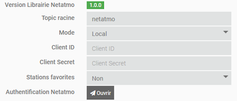

# Plugin mqttNetatmo

## Beschreibung

Mit diesem Plugin können Sie über MQTT Daten von den Netatmo-Produkten Weather und Aircaire abrufen.

Sie können auch die Daten Ihrer bevorzugten Netatmo-Wetterstationen abrufen.

## Voraussetzungen

- Sie benötigen ein Netatmo-Entwicklerkonto (kostenlos).
- Dieses Plugin erfordert [MQTT Manager](https://market.jeedom.com/index.php?v=d&p=market_display&id=4213), ein offizielles und kostenloses Plugin.

## Installation

- Laden Sie das Plugin aus dem Market herunter.
- Aktivieren Sie das Plugin

# Netatmo Developer Account

- Gehen Sie auf die Seite [dev.netatmo](https://dev.netatmo.com/).
- Erstellen Sie ein Konto, falls Sie nicht bereits eines haben.
- Sobald Sie sich in Ihr Konto eingeloggt haben, klicken Sie auf "My Apps".

- Klicken Sie oben rechts auf die Schaltfläche "Create".

- Füllen Sie das Create-Formular aus und klicken Sie auf "Save".

- Sobald Sie das Formular bestätigt haben, erscheinen am Ende des Formulars die beiden Informationen, die Sie für die Konfiguration des Plugins benötigen.

# Konfigurationseinstellungen :

- **Root-Topic**: Root-Thema, auf das Jeedom hören soll.
- **Modus**: Fern oder Lokal. Siehe weiter unten.
- **Client ID**: Information, die im vorherigen Schritt auf der Netatmo-Website erhalten wurde.
- **Client Secret**: Information, die im vorherigen Schritt auf der Netatmo-Website erhalten wurde.
- **Bevorzugte Stationen** : Aktivieren Sie den Abruf der bevorzugten Wetterstationen.
- **Netatmo-Identifikation** : Link zur Netatmo-Authentifizierung.

## Die Modi Fern & Lokal :

- **Remote-Modus**: Sie haben einen anderen Server, der [netatmo-mqtt](https://github.com/WoCha-FR/netatmo-mqtt) ausführt. Dieser muss so konfiguriert sein, dass er eine Verbindung zum mqtt-Broker herstellt, der von **MQTT Manager** verwendet wird.
- **Lokalmodus**: Der nodeJS-Daemon wird auf Jeedom ausgeführt, daher müssen Sie die Abhängigkeiten installieren.

## Einrichten des NETATMO-Kontos (nur lokaler Modus)

- Der Dämon muss gestartet werden, um die Authentifizierung durchzuführen.
- **ACHTUNG** : Sie müssen über die lokale IP-Adresse mit Ihrem Jeedom verbunden sein.
- Klicken Sie auf "Öffnen": Sie gelangen auf die Netatmo-Autorisierungsseite.
- Klicken Sie unten auf der Seite auf "JA, ICH AKZEPTIERE".
- Es ist vorbei!

# Geräte

Die Geräte sind über das Menü Plugins → Verbundene Objekte zugänglich.

Geräte werden erstellt, wenn sie von MQTT Manager entdeckt werden.

## Einrichtung von Geräten

Wenn Sie auf ein Gerät klicken, finden Sie seine Informationen :

- **Ausrüstungsname**: Der Name Ihrer Ausrüstung, der von RING abgerufen wurde.
- **Elternobjekt**: Zeigt das Elternobjekt an, zu dem die Ausrüstung gehört.
- **Kategorie**: Hier können Sie die Kategorie der Ausrüstung auswählen.
- **Aktivieren**: Hiermit können Sie Ihre Ausrüstung aktivieren.
- **Sichtbar**: Macht Ihre Ausrüstung auf dem Dashboard sichtbar.
- **Typ**: Der Typ des Moduls (schreibgeschützt).
- **Identifikator**: Der eindeutige Identifikator des Moduls.

## Die Befehle

Für jede Ausrüstung können Sie die Befehle sehen, die durch die automatische Entdeckung erstellt wurden.

# Gesundheitsseite

Das Plugin verfügt über eine "Gesundheits"-Seite, auf der Sie auf einen Blick die Aktivitäten der Ausrüstung sehen können.

