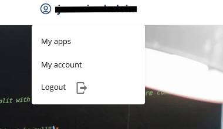
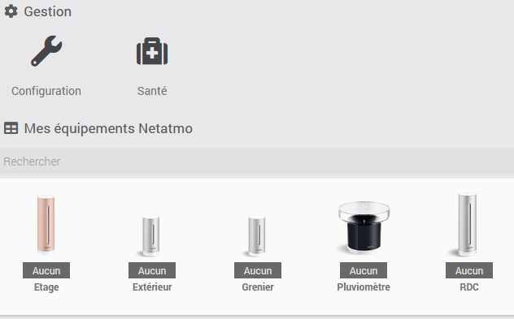
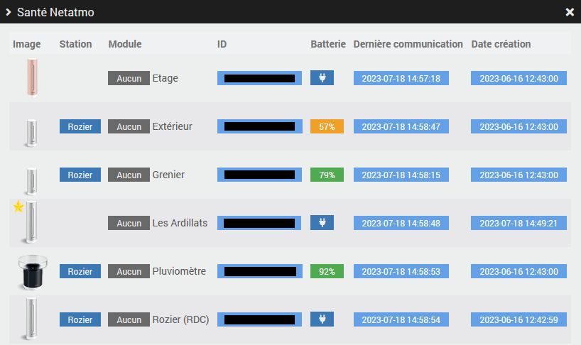

# Plugin mqttNetatmo

## Description

This plugin enables you to retrieve data from Netatmo's Weather and Aircaire products via MQTT.

You can also retrieve data from your favourite Netatmo weather stations.

## Prerequisites

- You must have a Netatmo developer account (free).
- This plugin requires [MQTT Manager](https://market.jeedom.com/index.php?v=d&p=market_display&id=4213), an official and free plugin.

## Installation

- Download the plugin from the market
- Activate the plugin

# Netatmo Developer Account

- Go to [dev.netatmo](https://dev.netatmo.com/)
- Create an account if you do not already have one.
- Once connected to your account, click on "My Apps".

- Then click on the "Create" button in the top right-hand corner.

- Fill in the creation form and click on "Save".

- Once the form has been validated, the two pieces of information you'll need to configure the plugin will appear at the bottom of the form.

# Configuration parameters :

- **Root Topic**: Root topic that Jeedom should listen to.
- **Mode**: Remote or Local. See below.
- **Client ID**: Information obtained from the Netatmo website in the previous step.
- **Client Secret**: Information obtained during the previous step on the Netatmo site.
- **Favourite stations** : Activate the retrieval of favourite weather stations.
- **Netatmo identification** : Link to Netatmo authentication.

## Distant & Local modes :

- **Remote mode**: You have another server running [netatmo-mqtt](https://github.com/WoCha-FR/netatmo-mqtt). This must be configured to connect to the mqtt broker used by **MQTT Manager**.
- **Local Mode** : The nodeJS daemon runs on Jeedom, so you need to install the dependencies.

## Configuring your NETATMO account (Local mode only)

- The daemon must be started to perform authentication.
- **ATTENTION** : You must be connected to your jeedom via its local IP address
- Click on "Open": This will take you to the Netatmo authorisation page.
- Click "YES, I AGREE" at the bottom of the page.
- It's all over!

# Equipment

Devices can be accessed from the Plugins → Connected Objects menu.

Devices are created when they are discovered by MQTT Manager.

## Equipment configuration

Click on a piece of equipment to view its information:

- **Equipment name**: Name of your equipment retrieved from RING.
- **Parent object**: indicates the parent object to which the equipment belongs.
- **Category**: Allows you to choose the category of the equipment.
- **Activate**: enables you to make your equipment active.
- **Visible**: makes your equipment visible on the dashboard.
- **Type**: the type of module (read-only).
- **Identifier**: the unique identifier of the module.

## Commands

For each piece of equipment, you can see the commands created by auto-discovery.

# Health page

The plugin has a "Health" page that lets you see equipment activity at a glance.

