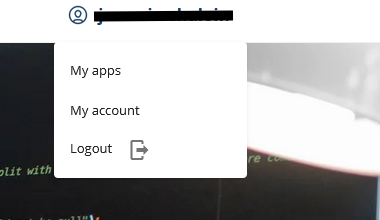
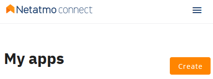
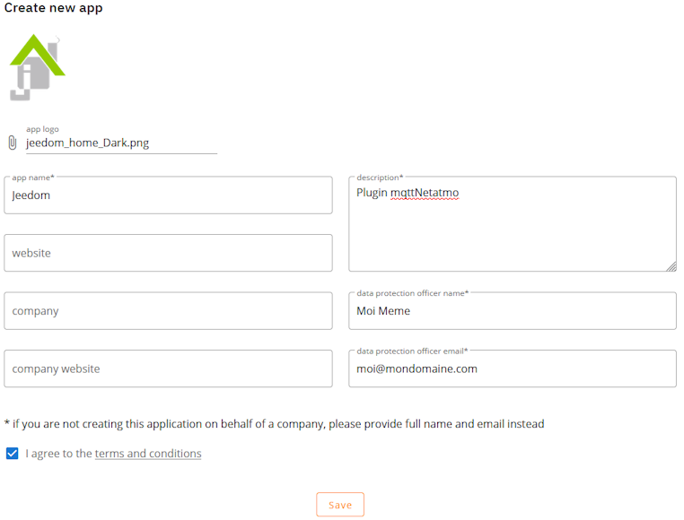
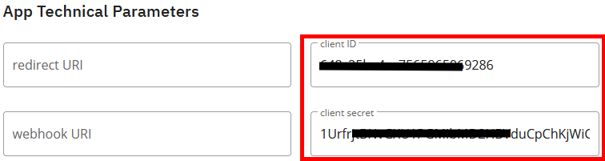
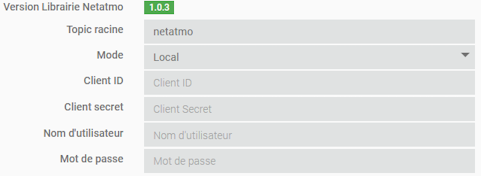
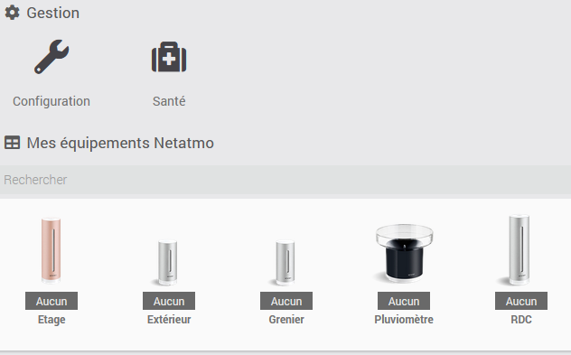
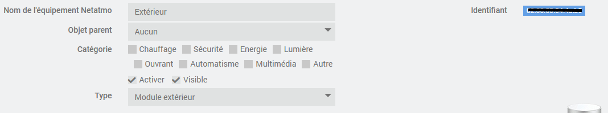
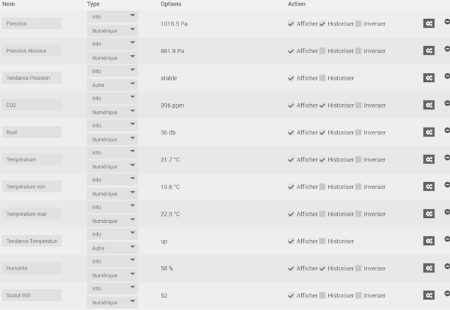
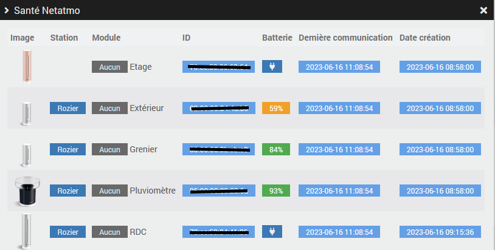

# Plugin mqttNetatmo

## Descripción

Este plugin permite recuperar datos de los productos Weather y Aircaire de Netatmo vía MQTT.

## Requisitos previos

- Debes tener una cuenta de desarrollador Netatmo (gratuita).
- Este plugin requiere [MQTT Manager](https://market.jeedom.com/index.php?v=d&p=market_display&id=4213), un plugin oficial y gratuito.

## Instalación

- Descarga el plugin desde el market
- Activar el plugin

# Cuenta de desarrollador Netatmo

- Vaya a [dev.netatmo](https://dev.netatmo.com/)
- Cree una cuenta si aún no tiene una.
- Una vez conectado a su cuenta, haga clic en "My Apps".

- A continuación, haga clic en el botón "Create" de la esquina superior derecha.

- Rellene el formulario de creación y haga clic en "Save".

- Una vez validado el formulario, en la parte inferior aparecerán los dos datos necesarios para configurar el plugin.

# Parámetros de configuración :

- **Tema Raíz**: El tema raíz que Jeedom debe escuchar.
- **Modo**: Remoto o Local. Ver más abajo.
- **Client ID**: Información obtenida durante el paso anterior en el sitio Netatmo.
- **Client Secret**: Información obtenida durante el paso anterior en el sitio Netatmo.
- **Nombre de usuario**: Dirección de correo electrónico de su cuenta de desarrollador Netatmo.
- **Contraseña**: Contraseña de su cuenta de Desarrollador Netatmo.

## Modos Distante y Local :

- Modo remoto**: Tienes otro servidor ejecutando [mqtt4teleinfo](https://www.npmjs.com/package/mqtt4netatmo). Este debe estar configurado para conectarse al broker mqtt utilizado por **MQTT Manager**.
- Modo Local** : El demonio nodeJS corre en Jeedom, por lo que necesitas instalar las dependencias.

# Equipamiento

Se puede acceder a los equipos desde el menú Plugins → Objetos conectados.

Los equipos se crean cuando son descubiertos por MQTT Manager.

## Configuration des équipements

Haga clic en un equipo para ver sus detalles:

- **Nombre del equipo**: nombre de su equipo recuperado de RING.
- **Objeto padre**: indica el objeto padre al que pertenece el equipo.
- **Categoría**: permite elegir la categoría del equipo.
- **Activar**: permite activar su equipo.
- **Visible**: hace que su equipo sea visible en el cuadro de mandos.
- **Tipo**: el tipo de módulo (sólo lectura).
- **Identificador**: el identificador único del módulo.

## Pedidos

Para cada equipo, puede ver los pedidos creados por la detección automática.

# Página de salud

El plugin tiene una página de "Salud" que te permite ver la actividad del equipo de un vistazo.

